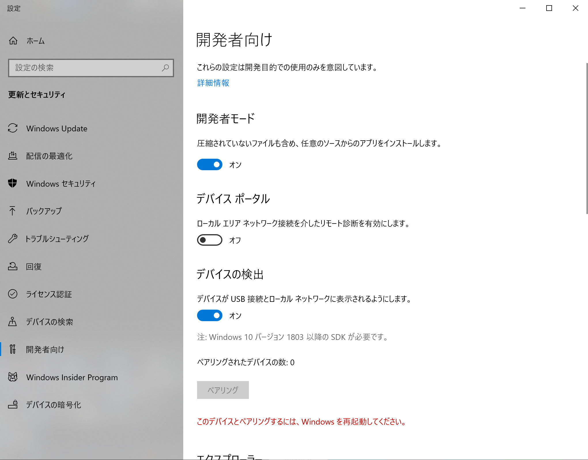

Visual Studio の Xamarin Forms から、Android端末の実機に接続する手順を記します。

Android端末の種類にも依ると思いますが、Webに掲載されている手順で上手くいかない場合に参考にして下さい。

## 手順

環境は以下となります。

- Visual Studio 2023
- Android端末 : Galaxy S10
- Androidバージョン : 12
- PCとAndoroid端末はUSB接続

### 1. Xamarin プロジェクト作成

Visual Studio で Xamarin のプロジェクトを作成して開きます。

### 2. Android SDK Managerを起動

タブの ツール > Android > Android SDK Manager を起動します。

### 3. Android関連のソフトウェアをインストール

接続するAndroid端末のAndroiバージョンに対応したSDK Platformをインストールします。

Androidバージョン12の場合
- プラットフォーム > Andoroid 12.0 - S > Android SDK Platform 31

また、Andoroid端末とUSB接続するのでドライバーも必要です。
- ツール > 追加 > Google USB Driver

### 4. PCを開発者モードに変更

設定 > 開発者向け で設定を変更します。
- 開発者モード : ON
- デバイスの検出 : ON

### 5. Android端末を開発者モードに変更

Galaxyの場合は以下の手順です。

- 設定アプリ > 端末情報　を開く
- ソフトウェア情報　を選択
- ビルド番号 を 7回連続 でタップ

これで開発者モードがONとなり、設定アプリの一番下に「開発者向けオプション」が表示されます。

### 6. Andoroid端末のUSBデバッグを有効

引き続き、Andoroid端末の「開発者向けオプション」設定を変更します。
- USBデバッグ : ON に変更

この時点で、PCとAndoroid端末をUSBケーブルで接続し、Visual Studio の Androidプロジェクトからデバッグ起動する際に「Andoroid端末」が表示されていれば問題無く完了です。

もし、この時点でもVisual Studio上でAndoroid端末を認識していないようであれば、以下を試して下さい。

### 7. USBケーブル変更

PCとAndoroid端末をUSB接続しているにも関わらず、PCのエクスプローラー上にAndoroid端末が表示されていない場合、**USBケーブルが対応していない可能性**があります。

USBケーブルを変更し、WindowsがAndoroid端末を認識しているか確認してください。  
（通常、USB接続した時点でポップアップ等が表示されます）

### 8. Android のUSB設定を変更

Andoroid端末の「開発者向けオプション」設定を変更します。
- 標準USB設定 > **画像を転送** を選択

ここまでの設定で概ね上手くいくと思います。

これでもPCがAndoroid端末を認識しない場合は以下をお試しください。

### 9. Samsungドライバーをインストール
PCにSamsungドライバーをインストールしてみます。

[https://developer.samsung.com/android-usb-driver](https://developer.samsung.com/android-usb-driver)

それでも上手くいかない場合は、他サイトを参考にしてトライしていくしかないでしょう。
___

以上です。

