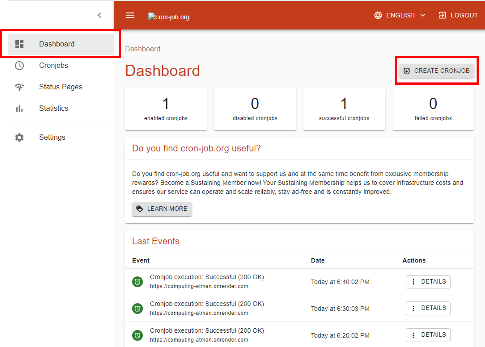
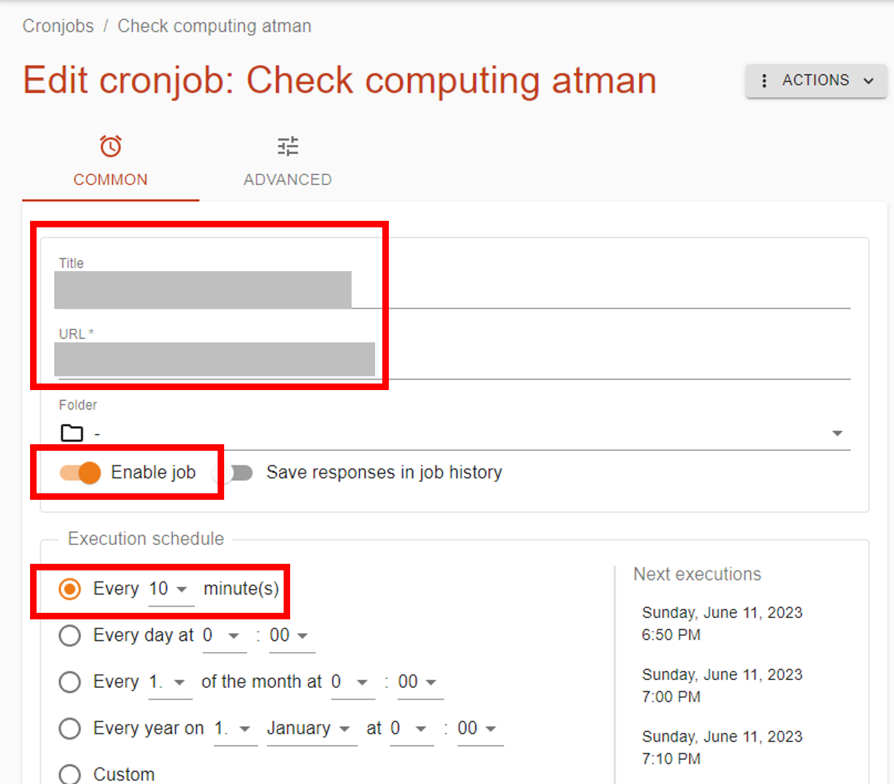
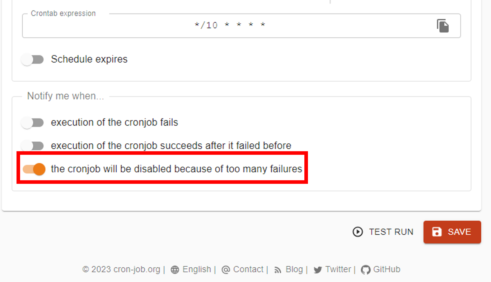
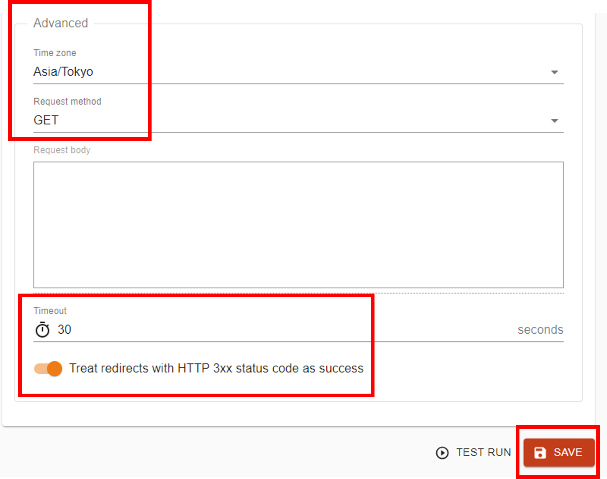

Render.comのFreeプランは非アクティブな状態が15分間続くとスリープ状態になります。  

対策として、定期的なレスポンスを送る[cron-job.org](https://console.cron-job.org/)を利用します。  
その手順を残しておきます。

## 1. cron-job.orgにアクセスしてアカウントを作成

[cron-job.org](https://console.cron-job.org/)  

> 参考サイト  
> [cron-job.org を利用して特定のURLに定期的にアクセスさせる](https://laboradian.com/access-url-using-cron-job-org/)

## 2. JOBを作成
Dashboard > CREATE CRONJOB をクリックします。  

  

## 3. COMMONを設定
URLやアクセス頻度を設定します。ここでは10分にしておきます。
  

実行が失敗した時の通知設定です。（任意でOK）  
  

## 4. ADVANCEDを設定
次にタブからADVANCEに切り替えて設定します。  
  

最後にCREATEボタンをクリックして終了です。