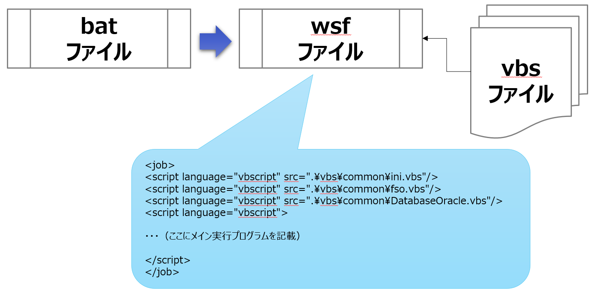

WSFは複数のスクリプトをまとめることが可能なXMLファイルです。これにより、機能ごとに分けて作成したVBSをまとめて流用したりすることが可能となり、すごく便利です。 （更にJScriptとVBSの共存等も可能）

今回、複数のVBSファイルをまとめて呼び出すパッケージのような扱い方を説明します。

[【ソースコードはこちら】](https://github.com/atman-33/template-vbs/tree/master/ExportCsvOracleWsf)

##  パッケージ構成
以前、記事にとりあげた[【VBS】Oracle DBからSELECTした結果をCSVファイルに保存](/computing-atman/2023/02/25/5-oracle-db-to-csv-vbs/)と同様の機能を bat、wsf、vbs の組み合わせで実現させていきます。

まずはパッケージ構成です。



▼wsf_oracledb_to_csv フォルダ
```text
Main.bat                     メイン実行ファイル
OraclToCsv.wsf         　　　各VBSを読み込むファイル
Config.ini                 　各設定情報が記載されたファイル
sql                          DBからデータ抽出するSQL文を格納
csv                          DBからデータ抽出したCSVファイル格納
vbs                          VBSのクラスやモジュールを格納
└ common                    共通で使用するクラスやモジュールが格納
　　├ DatabaseOracle.vbs    オラクルDB操作関連のクラス
　　├ fso.vbs               ファイルやフォルダを操作する関数
　　└ ini.vbs               iniファイルを操作する関数
```

wsfファイルは、VBSをまとめて読み込んで、それぞれの関数やクラスを扱うことができるところがポイントです。


## ソースコード解説
ここからはwsfファイルとbatファイルのコードを解説します。（vbsファイルに関しては、別記事で説明済みですので省略させて頂きます。）

### wsfファイル
wsfファイルはXML形式で記載します。

今回の例では、DB接続してCSV出力に必要な各VBSのクラスと関数を参照させました。

▼oracledb_to_csv.wsf
```wsf
<job>
<script language="vbscript" src=".\vbs\common\ini.vbs"/>
<script language="vbscript" src=".\vbs\common\fso.vbs"/>
<script language="vbscript" src=".\vbs\common\DatabaseOracle.vbs"/>
<script language="vbscript">

    ' ---- ---- ---- ---- ---- ---- ---- ---- ---- ---- ---- ---- ---- ---- ----
    ' brief : オラクルDBからSELECT文で抽出した結果をCSVに保存
    ' note  :
    ' ---- ---- ---- ---- ---- ---- ---- ---- ---- ---- ---- ---- ---- ---- ----

    ' Const INI_FILE = "Config.ini"     ' iniファイル名　※ここで設定せずにbatファイルから指定

    Dim SQL_FOLDER_PATH, CSV_FOLDER_PATH
    Dim SDB_PROVIDER, SDB_DATA_SOURCE, SDB_USER, SDB_PASS

    Dim ini
    ' ini = GetCurrentDirectory() & "\" & INI_FILE
    ini = GetCurrentDirectory() & "\" & Wscript.Arguments(0)

    ' #### #### #### #### #### #### #### #### #### #### #### #### #### #### ####
    ' 0. iniファイルの読み込み　※実行VBSファイルと同じカレントフォルダに保存
    SDB_PROVIDER = GetIniData(ini, "source_db", "provider")
    SDB_DATA_SOURCE = GetIniData(ini, "source_db", "data_source")
    SDB_USER = GetIniData(ini, "source_db", "user_id")
    SDB_PASS = GetIniData(ini, "source_db", "password")

    SQL_FOLDER_PATH = GetCurrentDirectory() & "\" & GetIniData(ini, "path", "sql_folder")
    CSV_FOLDER_PATH = GetCurrentDirectory() & "\" & GetIniData(ini, "path", "csv_folder")
    ' #### #### #### #### #### #### #### #### #### #### #### #### #### #### ####

    Dim objDBOracle     ' Oracle接続クラス
    Dim strSQLFiles     ' 実行するSQLのファイル群
    Dim strSQLFile      ' 実行するSQLのファイル
    Dim strSQL          ' 実行するSQL
    Dim objAdoRS        ' ADOレコードセット
    Dim csvText         ' SQLでSELECTしたCSVテキスト内容

    WScript.Echo "処理を開始します。"

    ' 1. DB接続
    Set objDBOracle = New DatabaseOracle
    objDBOracle.OpenDBOracle SDB_PROVIDER, SDB_DATA_SOURCE, SDB_USER, SDB_PASS

    ' 2. SQLファイル群の読込
    strSQLFiles = GetFileNames(SQL_FOLDER_PATH)

    ' 3. CSV生成
    For Each strSQLFile In strSQLFiles                          ' 各SQLファイルを繰り返し処理
        WScript.Echo strSQLFile
        strSQL = GetFileText(strSQLFile)                        ' SQL文の取得
        ' Msgbox strSQL
        objDBOracle.excuteSQLgetRS strSQL                       ' SQL文を実行してレコードセットを取得
        csvText = objDBOracle.getCSVTextFromRS()                ' レコードセットをCSV形式のテキストに変換

        writeFile CSV_FOLDER_PATH & "\" & GetBaseName(strSQLFile), csvText, "csv"   ' CSVファイル生成
    Next

    ' 4. DB切断
    objDBOracle.closeDB
    Set objDBOracle = Nothing

    WScript.Echo "処理が完了しました。"

</script>
</job>
```
上記のようにwsfファイル内で複数VBSを読み込むことが可能ですし、wsfファイル内にそのままVBSスクリプトを記載することも可能です。

### batファイル
▼main.bat
```bat
@echo off

rem if文、for文の中で変数を使う場合は!を使用可能
@setlocal enabledelayedexpansion

rem ---- 条件設定 ----
set script=OracleToCsv.wsf
set ini=Config.ini

cd %~dp0
Cscript %script% %ini%

pause
```
これでwsfファイルを起動させてもメッセージボックスは表示されずに処理が進みます。
